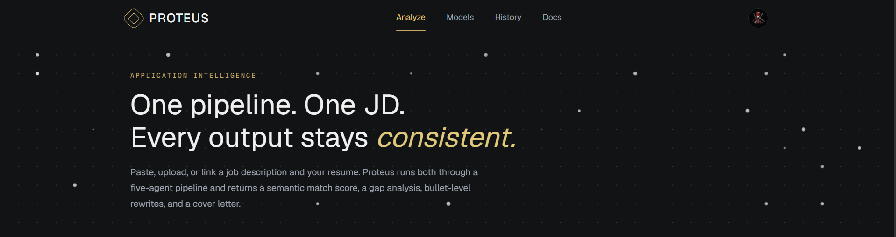

<p align="center">
  
</p>


<p align="center">
  <a href="https://proteus-phi.vercel.app">
    
  </a>
  <a href="https://proteus-phi.vercel.app/docs">
    
  </a>
  
  
  
</p>

---

> ⭐ **If PROTEUS gave you a smarter way to think about resume optimization — a star helps other engineers find it. Takes 2 seconds.**

---

## What it does

PROTEUS is a JD-aware resume analyzer that runs a **five-agent pipeline with a dedicated model for every step across Groq and Google Gemini** to produce consistent, actionable outputs from a single job description and resume.

| Output | What you get |
|--------|-------------|
| **Match Score** | Percentage alignment with category breakdown |
| **Gap Analysis** | Matched / partial / missing requirements ranked by impact |
| **Bullet Rewrites** | JD-aware rewrites with rationale and impact scores |
| **Tailored Resume** | ATS-safe export (TXT, Word, PDF) built from accepted rewrites |
| **Cover Letter** | Tailored letter from the same parsed context |
| **Priority Actions** | Ranked steps to improve your application |

Every output reads from the same parsed JD context — no contradictions between your score, gaps, rewrites, and cover letter.

## How it works

```
JD ──┐
     ├──→ [Parse] → [Match] → [Rewrite] → [Draft] ──→ Results
Resume┘
```

| Step | Agent | Model | Task |
|------|-------|-------|------|
| 01 | JD Parser | `qwen/qwen3.8-27b` (Groq) | Extract role, requirements, seniority |
| 02 | Resume Parser | `openai/gpt-oss-120b` (Groq) | Extract skills, experience, achievements |
| 03 | Gap Analyzer | `gemini-embedding-001` (Gemini) | Semantic embedding + exact word requirement matching |
| 04 | Rewriter | `openai/gpt-oss-20b` (Groq) | JD-aware bullet rewrites |
| 05 | Cover Letter | `gemini-2.5-flash` (Gemini) | Tailored letter generation |

> Models auto-update via GitHub Actions health checks every 3 hours.

<!-- MODELS AUTO-GENERATED START -->
### Active Models (auto-updated by health check bot)

| Role | Model | Last Checked |
|------|-------|--------------|
| jd-parser | `qwen/qwen3.8-27b` | 2026-09-30T17:18:57.007Z |
| resume-parser | `openai/gpt-oss-120b` | 2026-09-30T17:18:57.007Z |
| gap-analyzer | `gemini-embedding-001` | 2026-09-30T17:18:57.007Z |
| rewrite-suggester | `openai/gpt-oss-20b` | 2026-09-30T17:18:57.007Z |
| cover-letter | `gemini-2.5-flash` | 2026-09-30T17:18:57.007Z |
<!-- END MODELS AUTO-GENERATED -->

## Features

<details>
<summary><strong>Core Analysis</strong></summary>

- 3 ways to input a JD: paste, upload, or URL
- 2 ways to input a resume: paste or file upload (.pdf, .docx, .txt)
- Requirement match scoring (semantic Gemini embeddings + exact word matching, local fallback)
- Gap analysis ranked by impact with severity badges
- Bullet-level rewrite suggestions with before/after comparison
- Consistent cover letter generated from the same context
- Priority action items ranked by impact

</details>

<details>
<summary><strong>Platform</strong></summary>

- Per-user data isolation and analysis history
- Rate limiting (10 analyses/day)
- Streaming API (NDJSON) for real-time pipeline progress
- Mobile-responsive UI
- Dark theme with gold accent design system
- Three auth methods: magic link, Google, GitHub

</details>

<details>
<summary><strong>Reliability</strong></summary>

- Automatic model fallback on failure
- JSON retry with temperature escalation (3 attempts)
- 300s timeout on serverless functions
- Health checks every 3 hours via GitHub Actions
- Self-healing model registry (role-scoped swap pools — one outage can't collapse every step onto the same model)

</details>

## Tech Stack

| Layer | Technology |
|-------|-----------|
| Framework | Next.js 16 · App Router · TypeScript |
| Styling | Tailwind CSS v4 · Dark theme · Geist fonts |
| AI/ML | Groq (Qwen 3.8, GPT-OSS) · Google Gemini (Flash, Embeddings) |
| Database | better-sqlite3 (local) · Turso/libsql (Vercel) |
| Auth | NextAuth.js v5 · Magic Link · Google · GitHub |
| Validation | Zod v4 |
| PDF Parsing | unpdf |
| Deployment | Vercel · GitHub Actions |
| Rate Limiting | Custom per-user daily limits |

## API

| Endpoint | Method | Description |
|----------|--------|-------------|
| `/api/analyze` | POST | Run full pipeline |
| `/api/analyze/stream` | POST | Run pipeline with NDJSON streaming |
| `/api/history` | GET | List past runs |
| `/api/history/:id` | GET | Get run details |
| `/api/history/:id` | DELETE | Delete a run |
| `/api/models` | GET | List configured models |
| `/api/health` | GET | Health check |
| `/api/health/models` | GET | Model connectivity test for all pipeline steps |
| `/api/usage` | GET | Daily usage stats |

---

<p align="center">
  <strong>Built by <a href="https://github.com/DanielDeshmukh">Daniel Deshmukh</a> · Mumbai, India</strong>
</p>

<p align="center">
  <a href="https://proteus-phi.vercel.app">
    
  </a>
</p>
